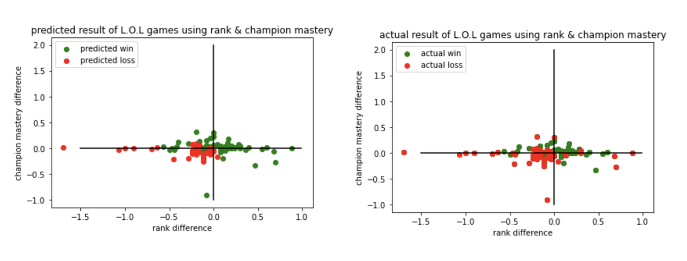
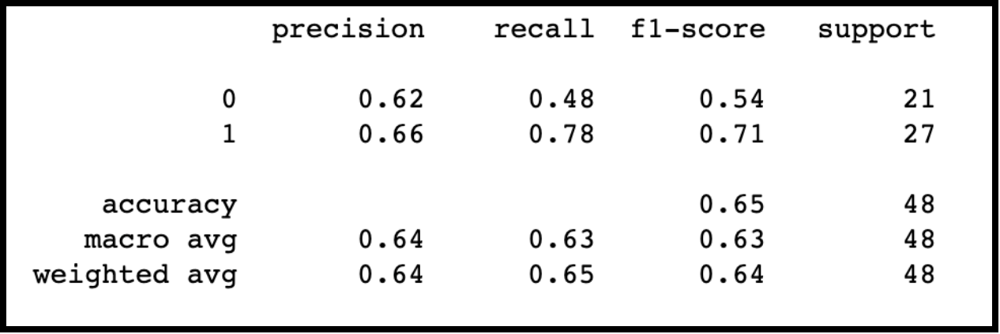

David Fraser

Predict the outcome of League of Legends Games

Abstract: League of Legends is a popular video game that has 4.2 million players daily [1]. This video game takes place on a mythical battlefield called Summoner’s Rift where two teams of five compete against each other. Each player controls a champion with a unique set of abilities that can be used in combat, to capture objectives, or move around the map. Champions work with their team to secure objectives and eventually destroy the opposing team’s nexus. Although League of Legends is a casual hobby for a lot of players, many take winning very seriously. For example, teams can compete in esports tournaments that have large prize pools that can reach the millions. In 2018, the League of Legends world championship had a prize pool of 6.7 million dollars [2]. For esports players and others who simply wish to gain a higher rank in the game, predictive analytics that provide insight into maximizing chances of winning is valuable. 

Overview: For this project, I will collect data using the League of Legends API that is supported by Riot Games. Because millions of League of Legends games are played every day, this API provides a substantial sample size for analytics. The problem I would like to solve is, how can I predict the outcome of a game with significantly higher than 50 percent accuracy given the players on both teams as inputs. Given the large sample size, it should be possible to split a sample of games into a training and test set where statistics of each player can be used to predict the outcome of a game with higher than 50 percent accuracy. Guessing which team will win randomly is like flipping a coin, so a target significantly higher than 50 percent is the goal. I am motivated to work with this data because there is a lot of money and interest in improving winrate in League of Legends.

Data Acquisition: I intend to work with League of Legends of game data. This data can be accessed through the League of Legends Developer API. The data that exists in this dataset includes detailed results of online matches and statistics for each individual player. The data can be accessed through API requests and the responses are formatted json. The features of a match that I am interested in are champion mastery, average rank, and average win rate of each player. The target feature will be the winning team. One limitation is the API rate limit of 100 requests/2min which will limit the amount of data I can collect. In fact, it is unrealistic to collect each player’s win rate with this constraint so I can only use champion mastery and rank.

Preprocessing: There are several things I did to get data in a usable format. First, I had to express player ranks (such as DIAMOND III 24lp) as decimal. I accomplished this by using a formula that converted rank to a number between 1.0 and 7.0. Second, I had to reduce the scale of champion mastery so that it’s range was similar to the data for rank. This is necessary because champion mastery can be in the millions and the maximum rank is less than ten. Third, I calculated each team’s average for each feature. Finally, I put the differences of these averages in my features matrix yielding only 2 features (rank, mastery) and 1 target (win/loss) for each row.

Model Selection: For this project, I will use a classification model. This is because my goal is to learn from two-dimensional labeled data points (games that are labeled as a win/loss) and classify new data. Specifically, I will use the k-nearest neighbors algorithm in order to determine if games with similar features will have similar outcomes. k-nearest neighbors are well suited for the number of features that I have chosen for my data. By using classification, I will be able to evaluate the results of my model using f1-score and cross-validation which is important for determining how meaningful my results are.

Findings: 
Below are the scatter plots of the predicted and actual outcomes of the samples I collected. Each point represents a single game played. Points further to the right represent games where the team had a rank advantage. Points further towards the top represent games where the team had a champion mastery advantage. It is worth noting that most games cluster around the origin most likely because RIOT Games uses an algorithm to match players against similarly skilled opponents [3]. Because RIOT’s algorithm also values queue time (the time it takes to match up 10 players into an online game) and player’s desired role (like different positions in football, LOL has different roles), some games are more balanced than others [3]. 

After some parameter tuning, I performed the k-nearest neighbor algorithm looking at the 5 nearest neighbors. I used 48 games as training data and 48 games as test data. The graphic above depicts how my model predicted games after this training process. The resulting f1 score of my model was 0.6458. I performed 5 iterations of cross-validation and the mean accuracy was 0.66 with a confidence interval of  (+/- 0.1). 
Because RIOT attempts to match similarly skilled players and because there are a large number of variables at play, my measure of success was an accuracy significantly above 50%. My results indicate that a classification model that uses rank and champion mastery can predict the outcome of a game around 60% of the time. Below are some further validation metrics.

[1]
https://leaguefeed.net/did-you-know-total-league-of-legends-player-count-updated/#:~:text=32.5%20Million%20registrations,playing%20at%20the%20same%20time.
[2]
https://en.wikipedia.org/wiki/2018_League_of_Legends_World_Championship
[3]
https://support-leagueoflegends.riotgames.com/hc/en-us/articles/201752954-Matchmaking-Guide

